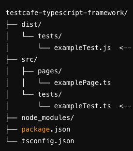

# TestCafe TypeScript Framework

This is a TestCafe automation testing framework using TypeScript. It is set up to compile TypeScript code to JavaScript and run tests in TestCafe. 

## Project Structure



## Prerequisites

- Node.js (You can download it from [here](https://nodejs.org/))
- npm (comes with Node.js)

## Setup

1. **Clone the repository:**
   ```sh
   git clone https://github.com/yourusername/testcafe-typescript-framework.git
   cd testcafe-typescript-framework

   ```shell
   $ npm install
   ```
Usage
Compile TypeScript code
To compile the TypeScript code, run:
```shell
$ npm run build
```

Run Tests
To run the tests, use:

```shell
$ npm run test
```

This will:

1. Compile the TypeScript code using the build script.
2. Run the tests in TestCafe using the compiled JavaScript files.

Example Test
The following is an example test located in src/tests/exampleTest.ts:

```javascript
import { Selector } from 'testcafe';
import examplePage from '../pages/examplePage';

fixture `Example Fixture`
    .page `https://example.com`;

test('Example Test', async t => {
    await t
        .expect(examplePage.exampleElement.exists).ok();
});

```

Example Page Object
The following is an example page object located in src/pages/examplePage.ts:

```javascript
import { Selector } from 'testcafe';

class ExamplePage {
    exampleElement: Selector;

    constructor() {
        this.exampleElement = Selector('#example');
    }
}

export default new ExamplePage();

```

Additional Configuration

Linter (Optional)
To add ESLint for code linting, install the following packages:

```shell
$ npm install eslint @typescript-eslint/parser @typescript-eslint/eslint-plugin --save-dev
```

Create an .eslintrc.json file:

```json
{
  "parser": "@typescript-eslint/parser",
  "plugins": ["@typescript-eslint"],
  "extends": ["eslint:recommended", "plugin:@typescript-eslint/recommended"],
  "rules": {
    // Your custom rules
  }
}

```

Code Formatter (Optional)
To add Prettier for code formatting, install the following packages:

```shell
$ npm install prettier eslint-config-prettier eslint-plugin-prettier --save-dev

```

Update .eslintrc.json:

```json
{
  "extends": [
    "eslint:recommended",
    "plugin:@typescript-eslint/recommended",
    "plugin:prettier/recommended"
  ]
}

```